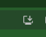
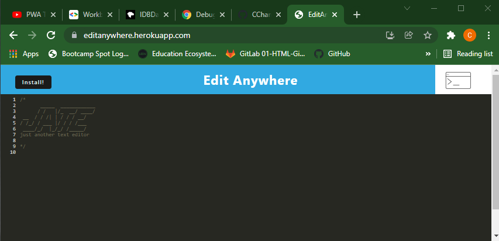

# EditAnywhere
```
EditAnywhere is a text editor which runs in the browser and applies syntax highlighting
for JavaScript code.
It is implemented as a Progressive Web App (PWA) such that it can be installed on your
desktop or on
a mobile device.  Is uses local storage on the device, both in an IndexedDb database,
as well as in LocalStorage.  When the app comes up, it loads any text that has been
saved in the LocalStorage or in the IndexedDb.  Any time the editor loses focus, the
text is saved to Local Storage and the IndexedDb.  HTML, CSS, and JavaScript for the
app are all cached so that the app can continue to work while offline.
```
## Intended uses
```
This app is particularly useful for a developer who wants to create notes or
code snippets with or without an internet connection.  This lets the developer
save them and reliably retrieve them for later use.
```

## Features
  * Uses IndexedDB to create an object store and includes both GET and PUT methods
  * The application works without an internet connection
  * Automatically saves content inside the text editor when the DOM window is unfocused
  * Bundled with webpack
  * Creates a Service Worker with workbox that caches static assets
  * The application uses babel in order to use async / await
  * The Application has a generated `manifest.json` using the `WebpackPwaManifest` plug-in
  * Can be installed as a Progressive Web Application
  * Javascript syntax highlighting
  * Deployed to Heroku at a live URL with build scripts

## Packaged libraries used in the app
  * webpack
  * idb
  * pwa
  * workbox

## To install the app:
```
When the app is brought up on your mobile device and before it is installed, an icon
is displayed to right in the URL location bar like this:
```

```
 When you click on the icon, it will install the app.
 Alternatively, you can click the `Install!` button inat the upper left corner.
```

## Screenshot of the app



## Github repo of the app
(https://github.com/CChampness/EditAnywhere)


## Link to live deployment of the app on Heroku
(https://editanywhere.herokuapp.com)

## Procedure to build and run the app on localhost
* The code is stored in the github repo with a client/server folder structure.
* Run `npm install`
* Run `npm run build` from the root directory.  This will bundle the JavaScript
  files using webpack.
* Run `npm run start` from the root directory.  This will start up the backend
  and serve the client.

## Procedure to install the app on the desktop or a mobile device
* Click on the `Install!` button at the upper left of the edit screen or on the
  download icon at the upper right, at the right side of the location bar.
